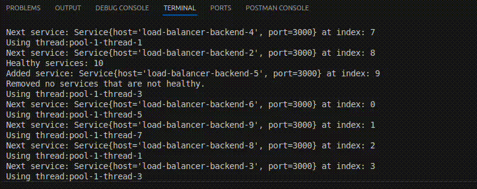

# Network Load Balancer (Layer 4) in Java

This project implements a basic **Network Load Balancer** operating at the OSI model Layer 4 (Transport Layer) using Java. It efficiently distributes incoming TCP requests across multiple **Node.js backend services**, scaled horizontally with Docker. The load balancer acts as a proxy server and uses a simple **Round Robin** strategy to distribute requests evenly among healthy backend instances.

## Features

- **Automatic Service Discovery:** Uses Docker Java API to detect running backend containers dynamically (excludes the load balancer container itself).
- **Health Checking:** Periodically polls backend `/health` endpoints to verify container health, marking services as healthy/unhealthy accordingly.
- **Stateful Health Adjustment:** Automatically adds/removes backend services to/from the pool based on their health status in real time.
- **Concurrent Request Handling:** Supports multiple simultaneous client requests through Java thread pools.
- **Round Robin Load Balancing:** Thread-safe, stateless Round Robin algorithm to fairly distribute requests evenly among healthy backends.

## Architecture Overview

The architecture can be pictured in the following diagram:

- **Main Application:** [`Main.java`](balancer/src/main/java/com/baitan/Main.java) — entry point initializing services and health checks.
- **Load Balancer Core:** [`ConcurrentLoadBalancer.java`](balancer/src/main/java/com/baitan/balancer/ConcurrentLoadBalancer.java) — manages incoming connections and dispatches requests.
- **Load Balancing Strategy:** [`ConcurrentRoundRobinStrategy.java`](balancer/src/main/java/com/baitan/balancer/strategy/ConcurrentRoundRobinStrategy.java) — implements thread-safe round robin logic.
- **Service Model:** [`Service.java`](balancer/src/main/java/com/baitan/balancer/Service.java) — represents backend service container metadata and can forward requests to their respective service containers.
- **Health Checker:** [`HealthChecker.java`](balancer/src/main/java/com/baitan/balancer/health/HealthChecker.java)  monitors backend health and updates service lists.
- **Health Check Thread:** [`HealthCheckThread.java`](balancer/src/main/java/com/baitan/balancer/health/HealthCheckThread.java) — An indefinite running loop that periodically uses the health checker to retrieve the healthy services and synchronise updates with the list of services maintained by the balancing strategy.
- **Proxy Handler:** [`ProxyHandler.java`](balancer/src/main/java/com/baitan/balancer/handlers/) — forwards client requests to selected backend instances.

## How It Works

1. **Startup:** On launch, the load balancer queries Docker API to discover running backend containers and initializes the round robin distribution.
2. **Periodic Health Checks:** A dedicated background thread continuously monitors `/health` endpoints of services; unhealthy containers are dynamically removed and can be re-added upon recovery.
3. **Request Routing:** Incoming requests to `localhost:8080` (the endpoint of the load balancer) are proxied to the next available healthy backend in round robin order.
4. **Concurrency:** Uses Java thread pools to handle many simultaneous client connections efficiently.

## Load Balancing Strategy

- **Round Robin:** Simplest load balancing approach cycling through backends sequentially.
- Adequate for uniform backend workloads (e.g., simple "Hello World" Node.js servers in this case).
- Not optimal if backends have uneven capacity or workload variations.
- For more complex environments, consider advanced algorithms like Least Connections or Least Response Time.

## Health Checking Details

- Uses Docker Java API (via Maven) to detect containers.
- Regularly polls backend `/health` endpoints.
- Backends return HTTP 200 are healthy; else are marked unhealthy.
- Simulates failure with a 5% chance of returning HTTP 500.
- Immediately updates backend list for load balancing.
- Adjusts round robin index to avoid service skipping on removal.

## Usage Instructions

1. **Prerequisites:**

   - You must have Docker/Docker Client installed. Please follow the installation guide for Windows/Mac/Linux accordingly. This project was developed on Ubuntu.

2. **Run Script:**
   - For ease of use, a bash script is present to ensure it is easy to orchestrate the build and start of the docker containers. This script is provided in the [`run.sh`](/run.sh) file.
   - The `run.sh` file should be executable after performing a `chmod +x` operation beforehand.
   - The containers are built and the network is up with the `./run.sh dev` command in the terminal **while in the root folder**.
   - When finished, the docker compose network can be downed with the `./run.sh stop` command in the terminal **while in the root folder**.
3. **Send Requests:**

   - Access services through the load balancer at `http://localhost:8080`.
   - Requests are forwarded to healthy backend instances automatically.

## Testing

- Load tested with **Apache JMeter** simulating 1000 concurrent users ramped up over 100 seconds. In other words, 10 users accessing the load balancer at a given second.
- Verified even request distribution and healthy backend management.

Video recording of test results with average latency of 8ms and no errors:

---

The log obtained from performing `docker logs load_balancer` shows the automatic addition of healthy services and removal of unhealthy services, as well the sequential nature of the Round Robin strategy, showing the index of the next service for the request, as well as the name of the thread that will execute the operation.

The log is shown below:

---

An naive way of checking the Round Robin work is by accessing the load balancer server at `localhost:8080` and refresh the page every instance. It will show a change in the hex after 'Hello World' which is the container name. Because of using the scale command, it is not possible to set custom names for the container but it is clear that there is a sequence as expected in a round robin on hitting refresh page.

---

## Important Notes

- Only Docker containers exposing a `/health` endpoint that returns HTTP 200 are considered healthy and eligible for routing.
- The load balancer container must be named `/load_balancer` to ensure it is excluded from backend server routing.
- The Round Robin strategy implemented is fully thread-safe and suitable for concurrent, multi-threaded environments.
- **Potential future improvements include**:
  - Implementing a dynamic load balancing algorithm to optimize traffic distribution based on real-time metrics.
  - Adding security measures such as throttling to mitigate cyber threats, especially Distributed Denial of Service (DDoS) attacks.
  - Enhancing logging to provide more detailed request tracking and diagnostics.
  - Introducing auto-scaling capabilities for the load balancer container to prevent it from becoming a single point of failure.
  - `JUnit` tests could be added with a more test driven approach as the codebase grows and becomes more complex.

## License

This project is licensed under the MIT License.
